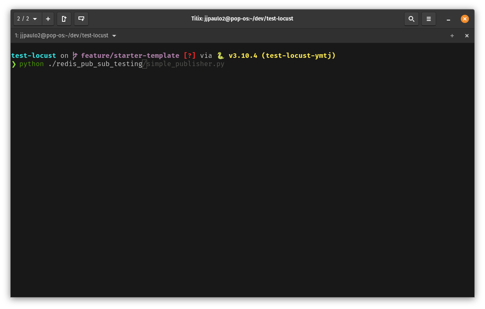

# My ZSH configurations

This repository contains my personal terminal configurations with plugins and whatever I like to use. 

Today I use Pop OS, with Tilix as my terminal emulator. The scripts inside the `pre-configure` folder must cover my distro-based configurations. I also will put there scripts for Mac OS and Arch Linux.

### Screenshot



Taken from Tilix running on Pop OS.

## Plugins

- [oh-my-zsh](https://github.com/ohmyzsh/ohmyzsh/)
    - [git](https://github.com/ohmyzsh/ohmyzsh/tree/master/plugins/git)
    - [asdf](https://github.com/ohmyzsh/ohmyzsh/tree/master/plugins/asdf)
    - [dotenv](https://github.com/ohmyzsh/ohmyzsh/tree/master/plugins/dotenv)

- [asdf](https://github.com/asdf-vm/asdf)
    - [python](https://github.com/asdf-community/asdf-python)
    - [node](https://github.com/asdf-vm/asdf-nodejs)
    - [golang](https://github.com/kennyp/asdf-golang)

- [zplug](https://github.com/zplug/zplug)
    - [zsh-syntax-highlighting](https://github.com/zsh-users/zsh-syntax-highlighting)
    - [zsh-autosuggestions](https://github.com/zsh-users/zsh-autosuggestions)
    - [zsh-autoswitch-virtualenv](https://github.com/MichaelAquilina/zsh-autoswitch-virtualenv)

## Installing

Install distro dependencies:

```shell
chmod +x ./pre-configure/debian.sh
./pre-configure/debian.sh
```

After enter Oh-My-Zsh prompt, install the zsh configurations:

```shell
chmod +x ./configure.sh
./configure.sh
```
